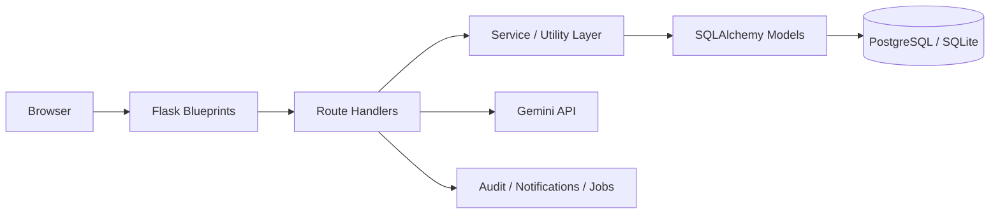

# Nutrify

Nutrify is a full-stack Flask application for managing **school nutrition operations, student wellness records, meal planning, and attendance-linked meal tracking**.

It is designed around three roles:

- **Master Admin** credential (platform-admin : masteradmin123): manages the entire platform, schools, users, AI policies, security hooks, audit logs, and exports
- **School Admin** credential (BestSchool : school123): manages one school’s roster, food catalog, meal plans, attendance, staff permissions, reports, approvals, and templates
- **User** credential (Manit : 123456): a student or guardian-style portal account that can view meals, attendance, health insights, awareness content, and submit feedback

The project combines:

- a server-rendered Flask web application
- role-based access control and scoped data access
- SQLAlchemy models with Alembic migrations
- AI-assisted nutrition, recipe, meal-plan, and health-summary features
- deployment automation for Render

---

## Quick Facts

| Area | Details |
| --- | --- |
| Backend | Flask, SQLAlchemy, Flask-Login, Flask-Migrate, Flask-WTF |
| Database | SQLite for local development, PostgreSQL for production |
| AI Integration | Google Gemini with local fallbacks and usage quotas |
| Auth Model | Username/password login with RBAC, password reset, session invalidation |
| Deployment | Render Blueprint, Gunicorn, health checks, pre-deploy migrations |
| Testing | Pytest, migration validation in CI |

---

## Live Deployment

**Render URL used for the project:**  
`https://nutrify-uo1e.onrender.com`

If you are reviewing this repository later, treat that link as the project’s current public deployment target rather than a guaranteed always-on demo.

---

## What This Project Does

Nutrify was built to support a practical school workflow:

1. A school signs into its dashboard.
2. The school creates or imports student accounts.
3. The school maintains a nutrition catalog and creates meal plans.
4. Staff records meal attendance for breakfast, lunch, and dinner.
5. Students log in to see their meals, nutrition summaries, health insights, and awareness content.
6. A platform-level master admin can supervise all schools, users, AI usage, security settings, exports, and operational activity.

In simple terms: **it is a school nutrition operations platform with both institutional controls and student-facing wellness tools**.

---

## Role Model

| Role | Purpose | Typical Actions |
| --- | --- | --- |
| `master_admin` | Platform-wide supervision | Create schools, manage users, review activity logs, inspect jobs, set AI limits, export platform data |
| `school_admin` | Operate one school | Add students, maintain food items, create meal plans, mark attendance, manage staff, review reports, approve workflows |
| `user` | Student / guardian portal | View meals, view attendance history, complete health form, generate AI meal plans, browse awareness content, submit feedback |

### Important Scope Rule

The system is designed so that operational data is **scoped by `school_id`**.  
School staff can work within their own school. Master admins can work across the platform. Student/guardian portal users see only their own linked data.

---

## Key Workflows

### 1. School onboarding

- Master admin creates a school root account
- School receives credentials
- School signs in and begins setup

### 2. Student onboarding

- School admin creates student accounts manually or imports them via CSV
- Each student gets a `User` account plus a linked `StudentDetail` profile
- Optional health metrics can be added immediately

### 3. Meal planning

- School admins build a school-specific food catalog
- Meal plans can be created per day
- Meal templates and bulk plan creation are available
- If the user does not have approval rights, plans enter an approval workflow

### 4. Meal attendance

- Attendance is tied to breakfast, lunch, and dinner checkboxes
- Presence is inferred from whether at least one meal was recorded
- CSV attendance import is supported

### 5. Student wellness portal

- Students see meal plans and nutrition summaries
- Students can generate AI-assisted meal plans and recipe suggestions
- Students can submit health form data to get AI-generated health insights
- Awareness content offers external nutrition and health references

### 6. Platform operations

- Master admin reviews analytics, notifications, audit logs, jobs, and exports
- Master admin can activate/deactivate schools and users
- Master admin can force password resets, lock accounts, invalidate sessions, and tune AI usage limits

---

## Feature Breakdown

### Core product features

| Category | Features |
| --- | --- |
| Authentication | Login, logout, session validation, password change, password reset, forced reset flow |
| Access control | RBAC decorators, school-scoped access, account lock/deactivation handling |
| Student management | Create, edit, soft delete, restore-ready patterns, health metrics, status tracking |
| Meal planning | Daily meal plans, editable plan items, templates, recurring/bulk generation support |
| Attendance | Per-meal attendance tracking, attendance summaries, CSV import, correction request workflow |
| Food catalog | Shared/default foods plus school-specific foods, add/edit/delete, nutrition fields |
| Student portal | Dashboard, meals calendar, nutrition history, AI meal generator, recipe finder, awareness content |
| Reporting | Student, attendance, and meal-plan CSV exports |
| Governance | Audit logs, notifications, approval requests, job records, AI usage logs |
| Platform admin | School management, global user management, analytics, AI policy control, security hooks, compliance exports |

### AI-enhanced features

| Feature | User-facing Purpose | Fallback Behavior |
| --- | --- | --- |
| Nutrition lookup | Search nutritional estimates for foods | Falls back to local approximation if AI is unavailable |
| Recipe finder | Generate a student-friendly recipe breakdown | Falls back to local recipe structure |
| Meal generator | Generate a personalized Indian meal plan | Falls back to locally generated meal suggestions |
| Health insights | Summarize student health form data | Falls back to locally generated insights |

AI usage is tracked in the database and governed by:

- global daily feature limits
- optional school- or user-specific policies
- user-level AI disable/enable flags

---

## Architecture in Simple Words

Nutrify is mostly a **server-rendered Flask application** with a few JSON endpoints for dashboards, search, analytics, and AI features.



### Application layers

| Layer | Responsibility |
| --- | --- |
| `app/routes.py` | Main school and student workflows |
| `app/platform_routes.py` | Master-admin and school operations beyond the main dashboard |
| `app/models.py` | Database entities and relationship logic |
| `app/platform_services.py` | Aggregated analytics, pagination, and control-plane queries |
| `app/security.py` | RBAC decorators and session guardrails |
| `app/audit.py` | Audit trail creation |
| `app/notifications.py` | In-app notifications and broadcasts |
| `app/ai_usage.py` | Quotas, policy resolution, and AI usage tracking |
| `app/jobs.py` | Background-job metadata structure and retry support |

---

## Database Model Overview

The application uses SQLAlchemy models with Alembic migrations.

| Model | Purpose |
| --- | --- |
| `User` | Core account model for master admins, school admins, students, guardians/staff-style portal users |
| `StudentDetail` | School-scoped student profile linked to a `User` |
| `HealthMetric` | Height/weight snapshots used for BMI and wellness summaries |
| `Attendance` | Meal attendance by date with breakfast/lunch/dinner booleans |
| `Food` | Nutrition catalog entries, shared or school-specific |
| `MealPlan` | One daily plan per school and date |
| `MealPlanItem` | Foods attached to a meal plan by meal type |
| `MealTemplate` / `MealTemplateItem` | Reusable meal-plan templates |
| `AuditLog` | Immutable platform and school activity trail |
| `PasswordResetToken` | Token-based reset flow |
| `Notification` | In-app user and school notifications |
| `ApprovalRequest` | Pending approval records for workflows such as meal plans and attendance |
| `AIUsageLog` | Quota and telemetry for AI features |
| `PlatformJob` | Metadata for import/export and retryable operational jobs |
| `UserFeedback` | Student/guardian-to-school communication records |
| `PlatformSetting` | Configurable platform settings such as rate-limit hooks and AI limits |
| `AIAccessPolicy` | School- or user-specific overrides for AI feature access |

### Data design notes

- Soft delete is applied to key operational models such as users, students, meal plans, and meal templates
- Session invalidation is version-based
- School scoping is enforced through role logic and scoped queries
- Approval workflows are modeled explicitly rather than hidden in ad hoc flags

---

## Key Routes and Endpoints

### Human-facing routes

| Route | Audience | Purpose |
| --- | --- | --- |
| `/` | Public | Landing page |
| `/login` | All roles | Sign in |
| `/dashboard` | Role-aware | Redirects to the correct dashboard |
| `/manage-foods` | School admin | Manage food catalog |
| `/meal-generator` | User | AI-assisted meal generation |
| `/health-form` | User | Health form + AI insights |
| `/insights` | School admin | School nutrition and attendance insights |
| `/platform` | Master admin | Platform control plane |

### JSON / utility endpoints

| Endpoint | Purpose |
| --- | --- |
| `/health` | Health check for deployment monitors |
| `/get-attendance/<date>` | Attendance summary for a given day |
| `/get-meal-plans` | Student meal-plan calendar data |
| `/get-meal-plan-detail` | Student meal-plan detail by date |
| `/get-nutrition-data/<date>` | Student nutrition summary by date |
| `/search-food` | Local + AI food lookup |
| `/get-ai-recipe` | AI recipe generation |
| `/get-ai-nutrition` | AI nutrition estimation |
| `/platform/analytics/data` | Master-admin analytics payload |
| `/students/search` | Filter/search students for school operations |

---

## Project Structure

```text
nutrition-platform/
├── .github/
│   └── workflows/
│       └── backend-ci.yml
├── backend/
│   ├── app/
│   │   ├── __init__.py
│   │   ├── config.py
│   │   ├── routes.py
│   │   ├── platform_routes.py
│   │   ├── models.py
│   │   ├── security.py
│   │   ├── audit.py
│   │   ├── notifications.py
│   │   ├── ai_usage.py
│   │   ├── jobs.py
│   │   ├── platform_services.py
│   │   ├── templates/
│   │   └── static/
│   ├── migrations/
│   │   ├── env.py
│   │   └── versions/
│   ├── tests/
│   ├── bin/
│   │   ├── docker_start.sh
│   │   └── render_predeploy.sh
│   ├── Dockerfile
│   ├── gunicorn.conf.py
│   ├── manage.py
│   ├── run.py
│   └── wsgi.py
└── render.yaml
```

### Notable files

| File | Why it matters |
| --- | --- |
| `backend/run.py` | Local development entry point |
| `backend/wsgi.py` | WSGI entry point for Gunicorn and Render |
| `backend/manage.py` | Bootstrap, seeding, migration-state repair, and deployment prep |
| `backend/gunicorn.conf.py` | Production worker and timeout tuning |
| `backend/Dockerfile` | Container build for Docker-based deployments |
| `render.yaml` | Render Blueprint with service + database provisioning |

---

## Technology Stack

| Layer | Tools |
| --- | --- |
| Web framework | Flask |
| ORM / migrations | SQLAlchemy, Flask-Migrate, Alembic |
| Authentication | Flask-Login, Flask-Bcrypt |
| Forms / security | Flask-WTF, CSRF protection |
| Rate limiting | Flask-Limiter with in-memory fallback |
| AI integration | `google-generativeai`, `requests` |
| Production server | Gunicorn |
| Testing | Pytest |
| Deployment target | Render |

---

## Getting Started

### Prerequisites

- Python **3.13** (the repository includes `.python-version`)
- `pip`
- A Google Gemini API key if you want live AI responses

### Local development setup

```bash
git clone <your-repo-url>
cd nutrition-platform/backend

python3 -m venv .venv
source .venv/bin/activate

pip install --upgrade pip
pip install -r requirements.txt
```

Create a `.env` file inside `backend/`:

```env
APP_ENV=development
SECRET_KEY=replace-this-in-real-environments
DATABASE_URL=sqlite:///database.db
GOOGLE_API_KEY=your-google-gemini-api-key

DEFAULT_SCHOOL_USERNAME=BestSchool
DEFAULT_SCHOOL_NAME=The Best School
DEFAULT_SCHOOL_PASSWORD=school123

DEFAULT_MASTER_ADMIN_USERNAME=platform-admin
DEFAULT_MASTER_ADMIN_PASSWORD=masteradmin123
DEFAULT_MASTER_ADMIN_EMAIL=
```

Apply the schema and seed development data:

```bash
python -m flask --app wsgi:application db upgrade -d migrations
python manage.py init-dev
```

Run the application:

```bash
python run.py
```

The app will start on:

`http://127.0.0.1:5000`

---

## Environment Variables

### Core variables

| Variable | Required | Example | Purpose |
| --- | --- | --- | --- |
| `APP_ENV` | Recommended | `development` / `production` | Selects configuration mode |
| `SECRET_KEY` | Yes in production | `super-secret-value` | Flask session and security key |
| `DATABASE_URL` | Yes in production | `postgresql://...` | Database connection string |
| `GOOGLE_API_KEY` | Recommended | `AIza...` | Enables live Gemini-backed AI features |

### Bootstrap account variables

| Variable | Default (local) | Purpose |
| --- | --- | --- |
| `DEFAULT_SCHOOL_USERNAME` | `BestSchool` | Initial school account username |
| `DEFAULT_SCHOOL_NAME` | `The Best School` | Initial school display name |
| `DEFAULT_SCHOOL_PASSWORD` | `school123` | Initial school password for local/dev seeding |
| `DEFAULT_MASTER_ADMIN_USERNAME` | `platform-admin` | Initial master admin username |
| `DEFAULT_MASTER_ADMIN_PASSWORD` | `masteradmin123` | Initial master admin password for local/dev seeding |
| `DEFAULT_MASTER_ADMIN_EMAIL` | empty | Optional bootstrap master admin email |

### AI / policy variables

| Variable | Default | Purpose |
| --- | --- | --- |
| `GEMINI_MODEL_NAME` | `gemini-2.5-flash` | Gemini model selection |
| `GEMINI_API_BASE_URL` | Google Generative Language API | Alternate Gemini base URL if needed |
| `PASSWORD_RESET_TOKEN_TTL_MINUTES` | `30` | Password reset link TTL |
| `AI_DAILY_LIMIT_NUTRITION_LOOKUP` | `100` | Daily per-user limit |
| `AI_DAILY_LIMIT_RECIPE_LOOKUP` | `60` | Daily per-user limit |
| `AI_DAILY_LIMIT_MEAL_GENERATOR` | `30` | Daily per-user limit |
| `AI_DAILY_LIMIT_HEALTH_INSIGHTS` | `30` | Daily per-user limit |

### Deployment / runtime variables

| Variable | Purpose |
| --- | --- |
| `ENABLE_PROXY_FIX` | Trust reverse-proxy headers in production |
| `LOG_LEVEL` | Structured log verbosity |
| `LOG_FILE` | Optional file log target |
| `RATELIMIT_STORAGE_URL` | External rate-limit store |
| `REDIS_URL` | Alternate rate-limit backing store |
| `WEB_CONCURRENCY` | Gunicorn worker count |
| `GUNICORN_THREADS` | Gunicorn threads per worker |
| `GUNICORN_TIMEOUT` | Request timeout |
| `DB_POOL_SIZE` / `DB_MAX_OVERFLOW` / `DB_POOL_TIMEOUT` / `SQLALCHEMY_POOL_RECYCLE` | SQLAlchemy pool tuning |
| `ERROR_TRACKING_DSN` | Placeholder DSN for external error tracking |

---

## Demo Credentials

After running `python manage.py init-dev`, the local development environment seeds these accounts:

| Role | Username | Password |
| --- | --- | --- |
| Master admin | `platform-admin` | `masteradmin123` |
| School admin (bootstrap school) | `BestSchool` | `school123` |

Notes:

- No student account is seeded by default
- Create students from the school dashboard after signing in as the school admin
- In production, bootstrap passwords should be rotated immediately after first sign-in

---

## How to Use the System

### Master Admin flow

1. Sign in as `platform-admin`
2. Open the **platform dashboard**
3. Create one or more school accounts
4. Review:
   - total schools, users, and students
   - recent audit activity
   - job status
   - AI usage
5. Use the control plane to:
   - create and update users
   - reset passwords
   - activate/deactivate schools
   - lock/unlock accounts
   - export data
   - adjust AI policies and security hooks

### School Admin flow

1. Sign in as the school account
2. Add students manually or import them from CSV
3. Manage school-specific food items
4. Create meal plans for current and future dates
5. Mark meal attendance for the current day
6. Use:
   - reports
   - approvals
   - staff management
   - meal templates
   - feedback review
   - insights dashboard

### Student / portal user flow

1. Sign in with the credentials created by the school
2. View today’s meals and nutrition summary
3. Use the AI meal generator
4. Open the health form for a health summary
5. Browse awareness content
6. Submit feedback to the school

### Guardian-style portal flow

Guardian-linked accounts use the same `user` role model and can access the same portal-style surface when linked to a student profile.

---

## Testing

Run the full backend test suite from the repository root:

```bash
cd backend
pytest tests
```

The CI workflow also validates that migrations can be applied cleanly before running tests.

---

## Database Migrations

Create a new migration:

```bash
cd backend
python -m flask --app wsgi:application db migrate -d migrations -m "describe change"
python -m flask --app wsgi:application db upgrade -d migrations
```

Useful management commands:

```bash
python manage.py init-dev
python manage.py seed
python manage.py ensure-migration-state
python manage.py prepare-deploy
```

---

## Deployment Overview

### Recommended production path

The repository is configured primarily for **Render** using:

- `render.yaml` for service and database provisioning
- `backend/bin/render_predeploy.sh` for schema preparation
- `gunicorn.conf.py` for production serving
- `/health` for deployment health checks

### What happens during deploy

1. Dependencies install
2. Pre-deploy script runs:
   - `python3 manage.py ensure-migration-state`
   - `python3 -m flask --app wsgi:application db upgrade -d migrations`
   - `python3 manage.py prepare-deploy`
3. Gunicorn starts the app

### Render Blueprint

The checked-in `render.yaml` provisions:

- one Python web service (`nutrify-web`)
- one managed PostgreSQL database (`nutrify-postgres`)
- health checks on `/health`
- CI-gated deploys via GitHub Actions

### Docker support

The repo also includes a Dockerfile and startup script:

- `backend/Dockerfile`
- `backend/bin/docker_start.sh`

This is useful for container-based platforms or reproducible local builds.

---

## Important Database Note for Render + Supabase

The recommended production setup in this repository is **Render managed PostgreSQL**.

If you choose to use **Supabase** as the external PostgreSQL provider on **Render**, use the **Supabase session pooler connection string on port `5432`**, not the direct database hostname and not the transaction pooler port `6543`.

Use this shape:

```env
postgresql://postgres.<project-ref>:<password>@aws-<region>.pooler.supabase.com:5432/postgres?sslmode=require
```

This matters because Render’s outbound networking is typically used through the pooler-friendly path rather than a direct IPv6 database host.

---

## Security and Reliability Notes

The current implementation includes:

- CSRF protection
- login rate limiting
- AI endpoint rate limiting
- session invalidation through `session_version`
- password reset tokens
- audit logs for important actions
- soft delete for core operational models
- production-only startup validation for secrets and database configuration
- structured logging and custom error pages

The app also tries to degrade gracefully:

- empty databases can be bootstrapped
- AI features fall back when Gemini is unavailable
- session user loading handles database failures defensively

---

## What This Repository Demonstrates

This project is useful as a portfolio piece because it shows work across:

- backend application design
- SQLAlchemy modeling
- schema migration discipline
- RBAC and scoped access
- operational workflows for a real-world domain
- AI integration with fallback behavior and quota controls
- deployment hardening on Render
- basic analytics, auditability, and export tooling

---

## Future Improvements

The platform already covers the core workflows, but sensible next steps would be:

- email delivery for password reset links and notifications
- a real async worker system (Celery / RQ / task queue)
- object storage for uploads and report artifacts
- better charting and richer longitudinal health analytics
- stronger guardian-specific views and consent flows
- end-to-end browser tests
- polished screenshot gallery and seeded demo data for public review

---

## Learning Outcomes

Working through this codebase teaches practical lessons in:

- designing multi-role systems without duplicating business logic
- evolving a Flask app from local SQLite development to production PostgreSQL
- keeping route handlers safe with commits, rollbacks, and audit trails
- building AI features that remain usable when external services fail
- documenting and deploying a production-oriented web application

---
